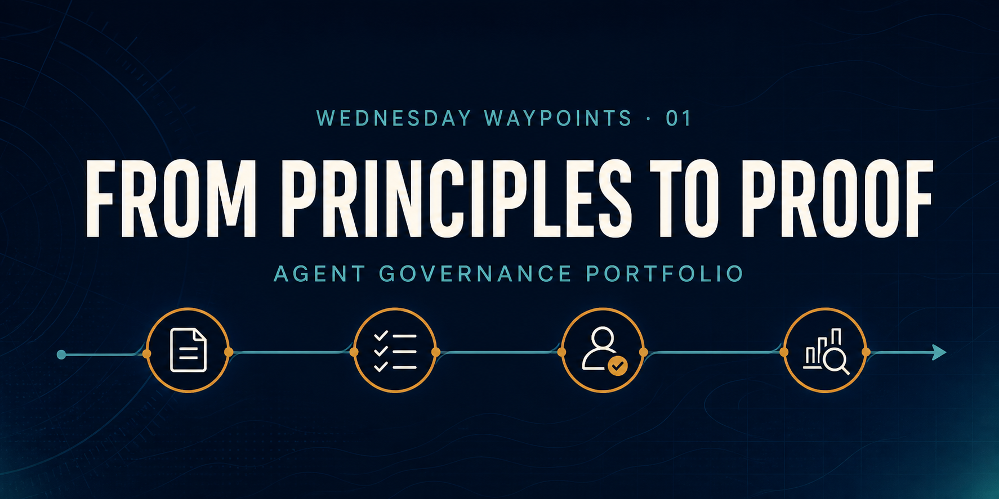
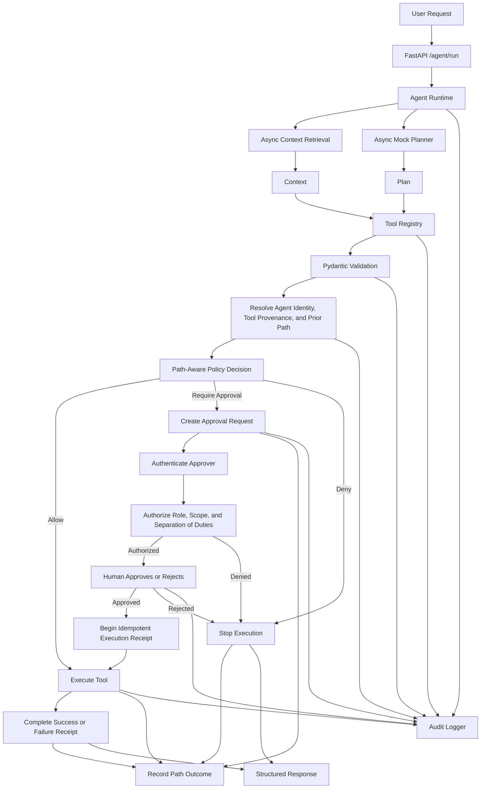

# Agent Governance MVP



**A test-verified control-plane prototype for auditable, approval-aware agentic AI.**

The model or planner proposes an action. The backend remains responsible for
tool validation, policy decisions, human authorization, execution, and audit
evidence. The goal is not to build a chatbot; it is to make agent behavior
inspectable and governable.

**Verified:** 62 automated tests · 16/16 policy scenarios · eight configured
outcome-benchmark scenarios

## Three-Minute Portfolio Review

**[Review the Evidence](REVIEWER_QUICKSTART.md)** — a five-minute walkthrough of one representative authorization-boundary scenario, its expected audit evidence, and what the check does not establish.

> **Publication status: PUBLIC.** This is the clean-history, sanitized portfolio
> repository. Private development history is excluded, and public commits use
> `jorgenunez1ghub` with the GitHub-provided no-reply address.

Use this self-contained path to separate shipped controls from planned or
unmeasured evidence:

1. [Approver authorization design](docs/approver-authorization.md) — local-demo identity, role/scope checks, and separation-of-duties controls.
2. [Outcome-evidence benchmark workflow](docs/outcome-evidence/README.md) — the versioned scenario contract, bundle workflow, harness, and verification gate.
3. [Outcome Evidence Protocol v1](docs/outcome-evidence/protocol.v1.md) — status is **PRE-REGISTERED / NOT RUN**; it defines an internal paired benchmark and its interpretation limits.
4. [Project Status](PROJECT_STATUS.md) — the current implementation, evidence boundary, gaps, and next decisions.

| Review question | Evidence |
|---|---|
| How are agent actions controlled? | [Architecture](docs/architecture.md) and the policy flow below |
| How is human approval governed? | [Approver authorization](docs/approver-authorization.md) |
| How is behavior verified? | `make verify`, 62 tests, and 16 versioned policy scenarios |
| What has not been proven? | [Outcome protocol](docs/outcome-evidence/protocol.v1.md) and [project status](PROJECT_STATUS.md) |

**Evidence boundary:** benchmark infrastructure has shipped; measured reviewer-performance outcomes have not been established. Approver authorization remains a local governed-execution demonstration, not production identity infrastructure.

The system demonstrates:

- Async agent execution
- Concurrent context retrieval and planning
- Tool registry design
- Pydantic tool validation
- Registered agent identities and autonomy levels
- Versioned tool provenance and risk metadata
- Explainable `allow`, `require_approval`, and `deny` policy decisions
- Backend-managed execution paths with risk escalation after adverse outcomes
- Expiring human approval gates with idempotent execution
- Authenticated approver identities with role, tool, risk, and action scopes
- Separation of duties between approver, declared requester, and governed agent
- Immutable per-attempt execution receipts and explicit failure/retry semantics
- Structured audit logging
- A versioned, runnable policy evaluation harness
- Governance-ready architecture

This is Milestone 2.7 / release `0.5.0` of a broader Agent Governance MVP focused on enterprise and public-sector agent workflows.

## Architecture



## Setup

Use Python `3.12.13` as declared in `.python-version`; the lock snapshot was verified with that runtime.

```bash
python3.12 -m venv .venv
source .venv/bin/activate
python -m pip install -r requirements.lock
```

## Run

```bash
uvicorn app.main:app --reload
```

Open the API docs at:

```text
http://127.0.0.1:8000/docs
```

## Verify

Run the canonical repository gate (tests, policy evaluations, compilation, and demo-shell validation):

```bash
make verify
```

## Evaluate

Run the versioned product-level policy scenario suite:

```bash
.venv/bin/python -m evals.run_policy_evals
```

## Demo Flow

Run the portfolio demo after the API is running:

```bash
./demo_flow.sh
```

The script shows allowed, approval-required, denied, and path-escalated tasks; authenticated approval; idempotent receipt replay; inspectable authorization evidence; versioned evaluation results; correlated audit events; and the async runtime proof point. See [docs/demo-script.md](docs/demo-script.md) for a short talk track.

## Research Context

This repo is positioned around governed execution: the runtime layer that decides whether an agent-proposed action should validate, execute, pause, or be denied. The current milestone authenticates the approver, checks action authority and separation of duties, and preserves that decision through the receipt, path, response, and audit trace.

See [docs/research-context.md](docs/research-context.md) for source-backed notes and roadmap implications.
See [docs/milestone-2.7.md](docs/milestone-2.7.md) for the current milestone contract, [docs/approver-authorization.md](docs/approver-authorization.md) for the identity boundary, [docs/approval-execution.md](docs/approval-execution.md) for execution semantics, and [docs/evals/EVALUATION_PLAN.md](docs/evals/EVALUATION_PLAN.md) for the evaluation method.

## PM Workflow

This repository is managed as a product artifact as well as a codebase. The PM layer records what is working, what remains intentionally out of scope, which risks block real-world use, and what evidence is required for the next increment.

| Artifact | Use it for |
|---|---|
| [Project Status](PROJECT_STATUS.md) | Current implementation, evidence, gaps, risks, and next three tasks |
| [Project Brief](docs/pm/PROJECT_BRIEF.md) | Problem, users, MVP scope, non-goals, and success measures |
| [Roadmap](docs/pm/ROADMAP.md) | Milestone outcomes from local MVP to enterprise-ready reference architecture |
| [Backlog](docs/pm/BACKLOG.md) | Prioritized, acceptance-criteria-driven product work |
| [Risk Register](docs/pm/RISK_REGISTER.md) | Product, technical, security/privacy, and delivery risks |
| [Decision Log](docs/pm/DECISION_LOG.md) | Architecture and product choices, alternatives, and tradeoffs |
| [Stakeholder Update Template](docs/pm/STAKEHOLDER_UPDATE_TEMPLATE.md) | Weekly evidence-based delivery updates |
| [Retrospective Log](docs/pm/RETRO_LOG.md) | Milestone lessons and owned improvements |
| [Release Notes](docs/pm/RELEASE_NOTES.md) | Shipped behavior, validation, and known limitations |
| [Evaluation Plan](docs/evals/EVALUATION_PLAN.md) | Versioned scenarios, assertions, isolation, and change control |

Repeatable delivery uses the [PM task issue form](.github/ISSUE_TEMPLATE/pm_task.yml) and [pull request template](.github/pull_request_template.md). AG-001 through AG-004 are complete; the next backlog item is **AG-005**, durable governance state.

## Example Requests

Safe internal action:

```bash
curl -X POST http://127.0.0.1:8000/agent/run \
  -H "Content-Type: application/json" \
  -d '{
    "user_id": "demo-user",
    "agent_id": "demo-agent",
    "task": "Create an internal action item to review project risk",
    "risk_level": "medium"
  }'
```

Approval-required external action:

```bash
curl -X POST http://127.0.0.1:8000/agent/run \
  -H "Content-Type: application/json" \
  -d '{
    "user_id": "demo-user",
    "agent_id": "demo-agent",
    "task": "Send an external message about the project risk",
    "risk_level": "high"
  }'
```

Denied out-of-scope action:

```bash
curl -X POST http://127.0.0.1:8000/agent/run \
  -H "Content-Type: application/json" \
  -d '{
    "user_id": "demo-user",
    "agent_id": "read-only-agent",
    "task": "Create an internal action item",
    "risk_level": "medium"
  }'
```

Approve a pending action:

```bash
curl -X POST http://127.0.0.1:8000/approvals/YOUR_APPROVAL_ID/approve \
  -H "Authorization: Bearer $DEMO_APPROVER_TOKEN" \
  -H "Idempotency-Key: approval-attempt-1"
```

Repeat the same request and key to replay its receipt without executing the tool again. A retryable failure requires a new key. If the header is omitted, the runtime uses a stable approval-scoped default key.

Reject a pending action:

```bash
curl -X POST http://127.0.0.1:8000/approvals/YOUR_APPROVAL_ID/reject \
  -H "Authorization: Bearer $DEMO_APPROVER_TOKEN"
```

Inspect recent audit events:

```bash
curl http://127.0.0.1:8000/audit/recent
```

Inspect registered governance inputs:

```bash
curl http://127.0.0.1:8000/governance/agents
curl http://127.0.0.1:8000/governance/approvers
curl http://127.0.0.1:8000/governance/tools
curl http://127.0.0.1:8000/governance/paths/YOUR_PATH_ID
curl http://127.0.0.1:8000/governance/approvals/YOUR_APPROVAL_ID
```

The committed approver tokens are local-demo defaults only. Set all four token variables from `.env.example` to new secrets before any shared use; production identity infrastructure remains out of scope.

To continue a backend-managed execution path, pass the `path_id` returned by an earlier `/agent/run` response. Callers can reference a path but cannot provide or rewrite its action history.

Audit logs are written as JSONL to:

```text
app/storage/audit_log.jsonl
```

## Tools

The registry contains three tools:

- `create_action_item`: trusted internal-write tool.
- `lookup_policy`: trusted read-only tool.
- `send_external_message`: trusted external-write tool.

Each definition includes a version, owner, source, risk class, and provenance status. The policy engine combines this metadata with the registered agent's scope and autonomy level.

## Why Async Matters

Agent systems spend much of their time waiting on I/O: context retrieval, model calls, policy checks, external APIs, and tool execution. Blocking each step in sequence makes a runtime slower and harder to scale.

This MVP uses `asyncio.gather()` so mock context retrieval and mock planning run concurrently. In a real system, that same pattern helps the runtime use wait time efficiently while preserving a clear execution flow.

## Governance Pattern

The runtime follows a control-plane pattern:

1. Accept a user request.
2. Retrieve context and create a plan concurrently.
3. Resolve the requested tool through a registry.
4. Validate tool arguments with Pydantic before execution.
5. Resolve the registered agent identity and versioned tool provenance.
6. Load the backend-managed prior execution path when a `path_id` is supplied.
7. Produce an explainable `allow`, `require_approval`, or `deny` decision.
8. Escalate a write when the prior path contains a failed, denied, or rejected action.
9. Pause approval-required actions and stop denied actions.
10. Authenticate the approver and authorize role, action, tool, risk, and separation-of-duties constraints.
11. Expire stale approvals and begin each authorized execution with an idempotency-bound receipt.
12. Execute only the exact validated, authorized tool call.
13. Complete the receipt with success or explicit retryable/terminal failure semantics.
14. Bind approver evidence to the receipt, path action, response, and structured audit events.

This keeps the model as a proposer. The backend remains responsible for validation, authorization, execution, and auditability.

## License

This project is licensed under the [MIT License](LICENSE). The license permits
use, modification, and distribution with preservation of the copyright and
license notice, and provides the software without warranty.
