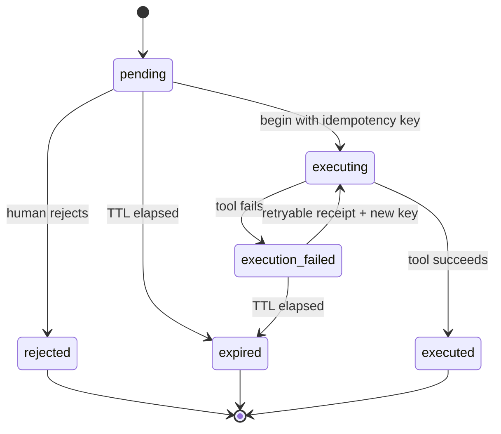

# Approval Execution Contract

Release `0.5.0` retains the receipt-backed state machine and requires an authenticated, authorized approver before any transition. The contract prevents duplicate side effects inside one running process and makes identity, retries, expiry, and failures inspectable.

## State Model

`pending` and retryable `execution_failed` approvals remain subject to the approval expiry time. Once an execution has begun, the receipt—not the original approval TTL—governs its completion. `executed`, `rejected`, and non-retryable `execution_failed` approvals are terminal.

## Authorization Gate

Approval and rejection require bearer authentication. The runtime checks active state, permitted action, tool scope, risk scope, and separation of duties before changing state. The successful authorization decision and approver ID are bound to the approval, receipt, path action, response, and audit trace. See [Approver Authentication and Authorization Contract](approver-authorization.md).

## Idempotency Rules

- The approval endpoint accepts an `Idempotency-Key` header.
- A missing header receives a stable approval-scoped default key for backward compatibility.
- The raw key is never stored or returned. Receipts contain only a SHA-256-derived fingerprint.
- Repeating a completed key replays its recorded receipt without invoking the tool again.
- Repeating a key while its first execution is in progress returns a transition conflict.
- A different key cannot execute an approval that already succeeded.
- A retryable failure may be attempted with a new key. Reusing the failed key replays the failure.
- A terminal failure cannot be retried with either the same or a new key.

## Expiry

Approvals default to a 900-second TTL, configurable with `APPROVAL_TTL_SECONDS` from 1 to 86,400 seconds. An expired approval fails closed:

- the tool is not invoked;
- no execution receipt is created;
- the approval and path action become `expired`;
- the audit trace records `approval_expired` and `run_failed`;
- the API returns HTTP `410 Gone`.

## Execution Receipts

Every actual execution attempt creates an immutable receipt with:

- approval, run, agent, approver, policy-decision, authorization-decision, path, and path-action identifiers;
- exact tool name, version, and validated arguments;
- idempotency-key fingerprint and attempt number;
- `in_progress`, `succeeded`, or `failed` status;
- retryability, result or error, and timestamps.

The runtime emits receipt-linked audit events at execution start and completion. `GET /governance/approvals/{approval_id}` returns the current approval record and its ordered receipts.

## Failure Semantics

Tool handlers can classify failures with:

- `RetryableToolExecutionError`: records a retryable failed receipt and allows a new-key attempt before expiry.
- `TerminalToolExecutionError`: records a terminal failed receipt and closes the approval.
- Any other exception: treated as terminal to fail closed.

A failure response is explicit (`execution_failed`) rather than ambiguous. It includes the failed receipt, retryability, and no successful tool result.

## Local-MVP Boundary

Approver credentials and identities are static local configuration, while the store is in memory and assumes a single process. Requester identity remains an unverified claim. Source-known demo credentials must not be used for shared deployments.  These guarantees do not survive restart and are not safe across multiple workers without transactional persistence and a shared uniqueness constraint. Durable, concurrency-safe governance state remains AG-005.
