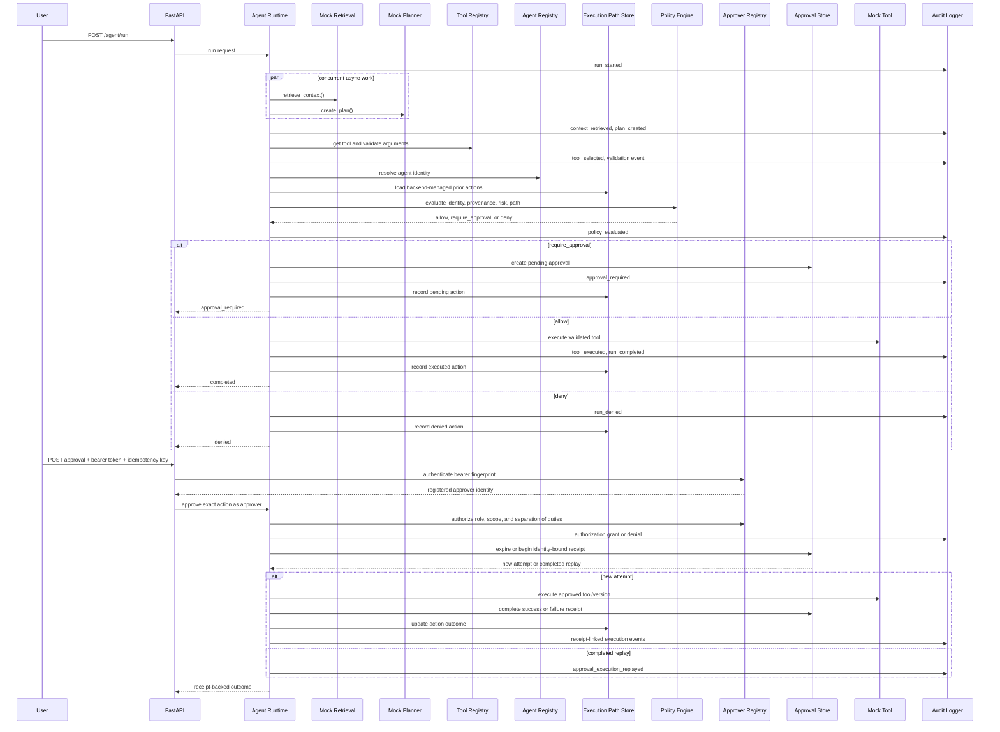

# Architecture

Agent Governance MVP is a small backend control plane for governed agent execution. Milestone 2.7 adds authenticated, scope-checked human approval and separation of duties to the evaluated, path-aware, receipt-backed policy contract.

The runtime is intentionally simple:

## Module Roles

- `app/api`: FastAPI routes and API-facing Pydantic schemas.
- `app/agent`: runtime orchestration, mock retrieval, and mock planning.
- `app/tools`: tool input schemas, tool registry, mock tool handlers, and retryable/terminal failure types.
- `app/governance`: agent and approver registries, explainable policy/authorization evaluation, and receipt-backed approval state management.
- `app/governance/path.py`: backend-managed ordered execution paths and normalized action outcomes.
- `app/audit`: JSONL audit logger.
- `evals`: versioned scenario fixtures, product-level assertions, and the command-line evaluation runner.
- `app/storage`: local audit file location.

## Runtime Boundary

The mock planner can propose a tool and arguments, but it cannot execute tools directly. The backend resolves the versioned tool, validates its arguments, resolves the agent identity, and asks the policy engine for a structured decision. Only an `allow` decision can execute immediately; `require_approval` pauses, and `deny` stops the run.

Approval records bind the decision to the requester claim, agent, policy decision ID, execution path/action, tool name, and tool version. Approval transitions require a registered bearer credential and a successful role/action, tool, risk, and separation-of-duties decision. Each actual attempt begins an immutable receipt bound to an idempotency-key fingerprint. Completed keys replay their receipt without calling the tool, stale approvals fail closed, and tool failures become explicit retryable or terminal outcomes. Receipts, path actions, responses, and audit events preserve approver and authorization-decision identifiers so an operator can reconstruct who acted and why the action did or did not execute. The requester remains a caller-supplied claim, which is recorded explicitly as unverified.

The approval and receipt store remains in memory. Its duplicate-execution protection is valid inside one running process, not across restarts or workers. See [Approval Execution Contract](approval-execution.md) for the transition rules.

## Execution Path Boundary

Every run starts a new backend-managed path unless the caller supplies a previously returned `path_id`. The caller cannot submit action history. The store verifies that the continuing agent owns the path and provides an immutable snapshot of prior normalized actions to policy evaluation.

Policy 2.1 requires human review when a proposed write follows a validation failure, denial, rejection, or execution failure on the same path. Identity, provenance, scope, and autonomy denials still take precedence. Read-only investigation remains available.

The in-memory path and approval stores are intentionally local-MVP components. They do not provide durable state, cross-worker coordination, concurrent update protection, retention, or integrity guarantees.
